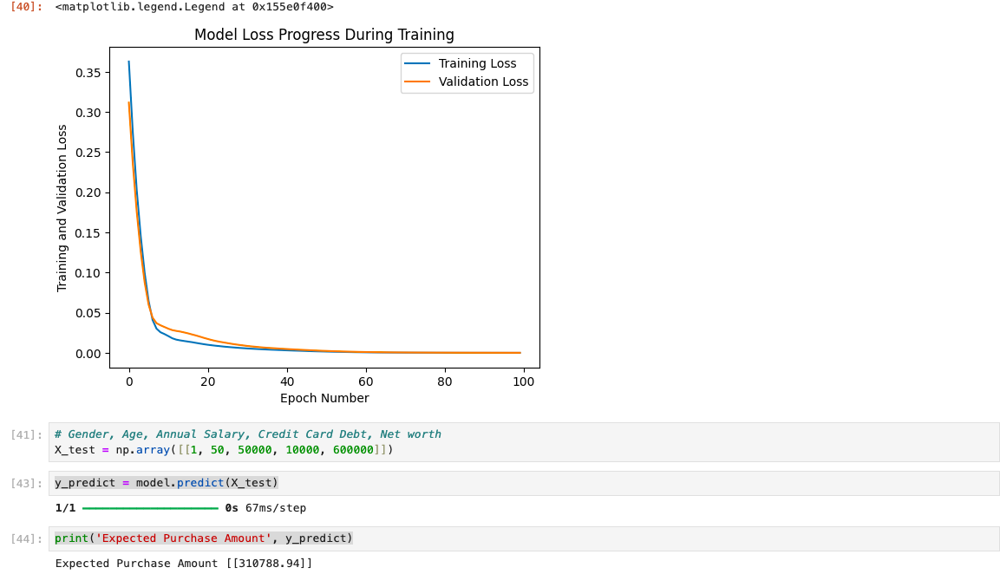

# Car Purchase Prediction using ANN
## Visualisation 

##  Project Overview
This project predicts the **Car Purchase Amount** customers are willing to pay, based on demographic and financial attributes such as:
- Age
- Annual Salary
- Credit Card Debt
- Net Worth
- Country & Gender

The dataset is provided in CSV format.

##  Approach
- Data cleaning & preprocessing
- Exploratory Data Analysis (EDA) with matplotlib & seaborn
- Feature encoding (for categorical variables)
- Normalization of numerical features
- Building an Artificial Neural Network (ANN) with Keras/TensorFlow
- Visualized training and validation loss across epochs

##  Results
The model successfully learned patterns in the dataset and produced reasonable predictions for purchase amounts.
Training and validation loss decreased over time, showing proper convergence.

## Requirements
Python 3.x
TensorFlow / Keras
NumPy
Pandas
Scikit-learn
Matplotlib
Seaborn

## How to Run

pip install -r requirements.txt

